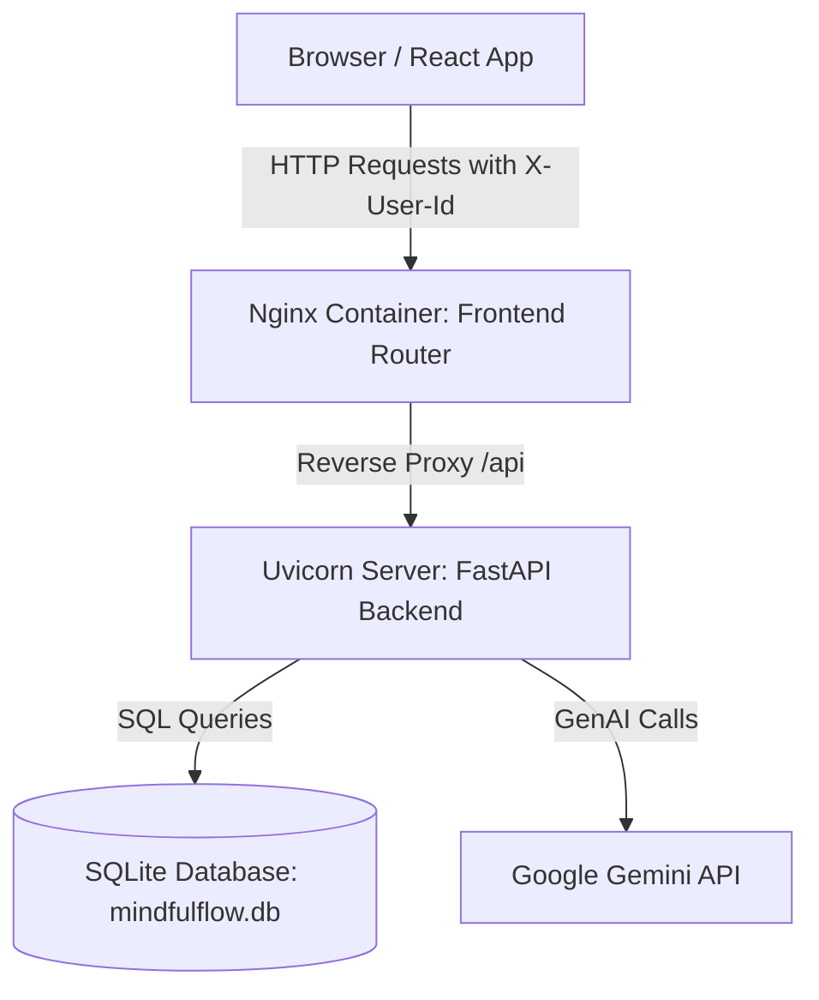
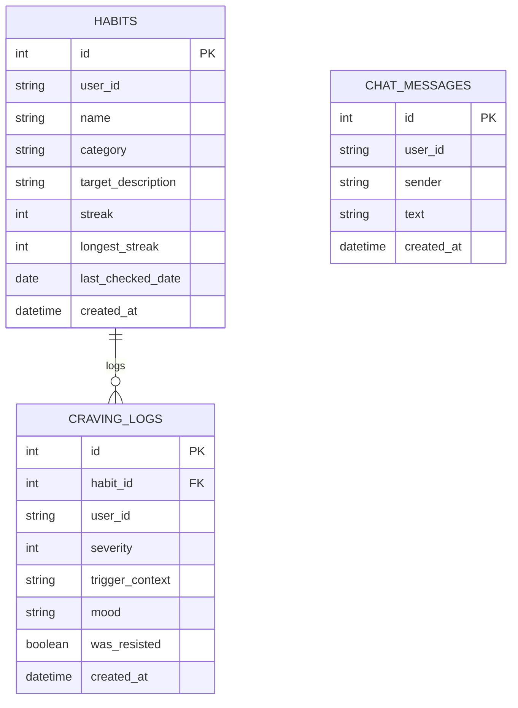

# Functional & System Architecture Documentation

This document describes the functional characteristics, system architecture, and core Generative AI capabilities of the **MindfulFlow** Habit Reclamation Platform.

---

## 1. Functional Overview
MindfulFlow is a GenAI-powered web application designed to help users break bad habits and resist cravings. Unlike typical tracking apps, MindfulFlow leverages cognitive behavioral therapy (CBT) principles combined with real-time generative AI to deliver personalized nudges, adaptive coaching, and SOS panic grounding.

### Core Capabilities
* **Personalized Tracking**: Logging bad habits with customizable categories, target triggers, and streak tracking.
* **Intelligent Nudges**: Dynamically generated, context-specific micro-nudges loaded on the user dashboard.
* **Adaptive AI Coach**: A conversation-based AI mentor powered by Google Gemini that acts as a supportive CBT coach, helping users work through cravings, identify emotional patterns, and develop strategies.
* **SOS Panic Grounding**: In-the-moment cognitive distraction and breathing exercises generated dynamically when the user triggers a "Panic Alert."
* **Anonymous Multi-User Session Isolation**: Zero-friction anonymous UUID sessions stored in browser `localStorage` and sent via `X-User-Id` HTTP headers, isolating all data between users on public deployments.

---

## 2. System Architecture

The application is structured as a containerized multi-tier web application, orchestrated with Docker:

### Components

#### Frontend (React Single-Page Application)
* **Tech Stack**: React 18, TypeScript, Vite, Tailwind CSS, Lucide icons.
* **Server**: Deployed inside an `nginx:alpine` container.
* **Session Manager**: Intercepts all requests using `apiFetch` to inject a persistent UUID session token unique to each browser.
* **Markdown Renderer**: Converts Gemini's structured Markdown responses into rich, styled HTML layouts dynamically.

#### Backend (FastAPI Application)
* **Tech Stack**: FastAPI, Uvicorn, SQLAlchemy.
* **Engine**: Python 3.11-slim container.
* **Routers**: Decoupled into domain-specific modules:
  * `/api/habits`: Habits CRUD and checkins.
  * `/api/logs`: Craving logs retrieval and creation.
  * `/api/chat`: AI Coach conversation history and message generation.
  * `/api/grounding`: SOS grounding and nudge generators.
* **Rate Limiting**: Custom proxy-aware rate-limiting middleware that extracts client IPs using `X-Forwarded-For` and `X-Real-IP` to protect Gemini API keys against abuse.
* **Observability**: Centralized structured logging format capturing HTTP requests, parameters, and system states.

#### Database (Storage Layer)
* **Tech Stack**: SQLite database file (`mindfulflow.db`) persisted in a Docker volume (`backend-data`).
* **ORM**: SQLAlchemy ORM with scoped SQLite sessions.
* **Multi-User Isolation**: Database tables (`habits`, `craving_logs`, `chat_messages`) include indexed `user_id` string columns to filter all transactions by the incoming session UUID.

---

## 3. Data Models

### SQLAlchemy Mapped Relations
1. **Habit**: Represents a habit a user is trying to reclaim. The `user_id` column filters ownership.
2. **CravingLog**: Captures craving events. Associated with a target `habit_id` and filtered by `user_id`.
3. **ChatMessage**: Stores conversational dialogue lines (both user prompts and AI responses) to maintain contextual memory for the Gemini Coach. Filtered by `user_id`.

---

## 4. Generative AI Engine & Prompts

MindfulFlow uses the official Google GenAI Python SDK (`google-genai`) targeting the **`gemini-flash-latest`** model.

### AI Coach Prompt
* **Context**: System prompts configure the coach as a CBT specialist who speaks empathetically, provides actionable, tiny micro-steps, and guides users using motivational interviewing.
* **Memory**: The backend fetches the last 15 messages from the database for the active `user_id`, formats them as chat history contents, and feeds them into the Gemini model to maintain continuous conversational context.

### Intelligent Nudges
* **Trigger**: Generated dynamically on the Dashboard.
* **Logic**: The backend queries the user's habits and recent craving logs. It feeds the data to Gemini, prompting the model to generate a supportive, personalized one-sentence nudge (e.g., celebrating a streak or encouraging resistance after a recent slip-up).

### SOS Grounding Exercises
* **Trigger**: Triggered when a user clicks the "SOS Grounding" button and enters their current mood.
* **Logic**: Prompts the Gemini model to generate a custom 5-4-3-2-1 sensory grounding exercise tailored to the specific target habit they are struggling with and their current emotional state (e.g. anxiety vs. boredom).
